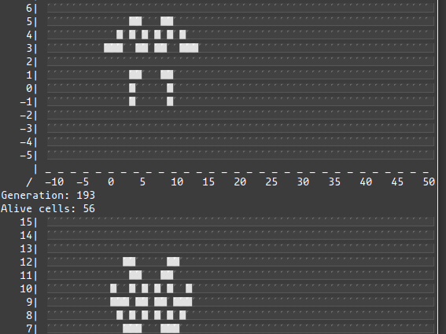
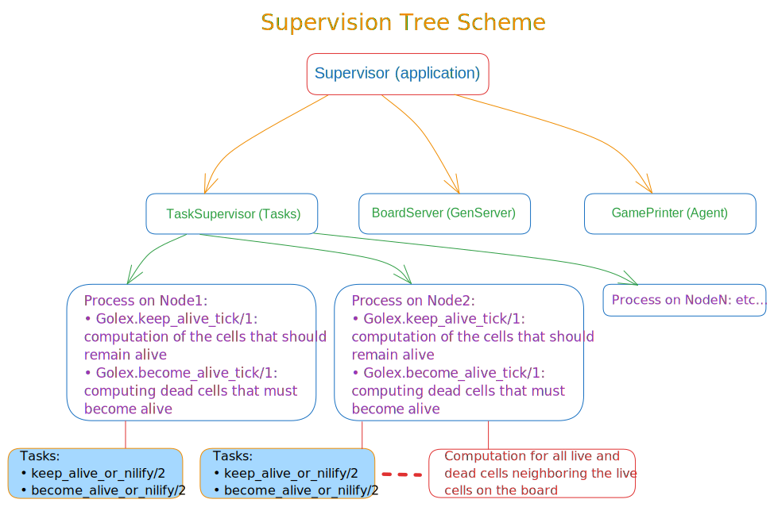

<div align="center">

# Golex


### [`Conway`](https://en.wikipedia.org/wiki/John_Horton_Conway)'s [`Game of Life`](https://en.wikipedia.org/wiki/Conway%27s_Game_of_Life) in [`Elixir`](https://elixir-lang.org/). Distributed Game of Life with Board Server API. Run it on multiple nodes.

#### Another (fun 😀) way to learn OTP in Elixir

<br />



<p><i>Pulsar</i>: a period 3 oscillator</p>

<br />
  
  

</div>

---

### 🚀 Why develop the application using OTP in Elixir?

Looking for projects to learn Elixir and with the idea of ​​making my own `Game of Life` I came across many repositories.

One of the simplest (due to its short length) yet elegant implementations is ***Saša Jurić***'s implementation (you can read this blog [post](https://www.theerlangelist.com/article/conway) and see the code [here](https://gist.github.com/sasa1977/6877c52c3c35c2c03c82)).

The code you can see here is more "basic" but includes an ***OTP*** implementation for educational purposes.

However, given the ease with which Elixir allows you to create concurrent and/or distributed applications, I have chosen to implement it this way, considering, as I just mentioned, for learning purposes.

However, a warning must be issued. In real-life programming, the ease with which Elixir and other BEAM-based languages ​​provide us with concurrent programming can lead to *premature optimizations* that almost always lead to a loss of application performance when *bottlenecks* occur. Using Elixir (or Erlang) does not prevent these problems from arising. For example, a process's message inbox having a long queue waiting to handle incoming messages, a single `DynamicSupervisor`/`Task.Supervisor` having to manage the initialization of a large volume of processes/tasks, or these, for whatever reason, taking a long time to initialize, can end up causing a bottleneck with the consequent decrease in performance. While this is possible, Elixir/Erlang provide us (unlike most other languages) with powerful tools (e.g. [`Observer`](https://hexdocs.pm/elixir/debugging.html#observer)) for detecting and pinpointing the problem. Once we've located the problem, we'd then have to refactor our code. In any case, this refactoring phase would only come after using *benchmarking* tools to demonstrate that we actually have a problem.

But back to our application, here's a diagram of how we organized the processes we launched to make it work the way we wanted:

<div align="center">
    
</div>

Briefly explained: the application supervisor starts 3 main processes: a `Task.Supervisor` or tasks dynamic supervisor, a `GenServer` for the `BoardServer` server and an `Agent` for `GamePrinter`.

BoardServer is the `API` we interact with to manage the business logic. GamePrinter, on the other hand, is an `Agent` that maintains a reference to the timer that forces the board to be rendered every second (in step with the cell generation rate), calling a module (`Golex.Console`) that actually draws the calculation results on the screen.

When we connect a second node from another terminal to the first node we started, we make the latter the master process and the single source of truth. Now, from the second node, we can interact with the `BoardServer` API.

From this API, we can start or stop the game and add new cell patterns. In either case, each calculation for each of the cells (live cells and dead cells neighboring the live cells) will be executed concurrently in tasks supervised by `Golex.TaskSupervisor` at the request of `BoardServer`.

---

### 👾 The game begins!

Once you meet the obvious requirement of having [Elixir & Erlang/OTP](https://elixir-lang.org/install.html) installed, you can clone this repository. Once you have the project folder in your file system, go into it and run the following command:

```
$ iex --sname node1 -S mix

#=> Compiling 1 file (.ex)
#=> Generated golex app

#=> 09:43:45.435 [info] Started Elixir.Golex.BoardServer with initial state equal to: {[], nil, 0}

#=> 09:43:45.439 [info] Started Elixir.Golex.BoardServer master
#=> Interactive Elixir (1.18.1) - press Ctrl+C to exit (type h() ENTER for help)
```

The previous command will execute the project, creating the application supervision tree, but with the particularity of generating an [`Erlang node`](https://www.erlang.org/doc/system/distributed.html) (which we call `node1`, but which the `BEAM` will recognize as `node1@your_computer_name`, which now appears in our terminal prompt: `iex(node1@your_computer_name)1>`). A distributed Elixir/Erlang system consists of a number of Erlang runtime systems communicating with each other. Each such runtime system is called a <i>node</i>. Message passing between processes at different nodes, as well as links and monitors, are transparent when pids are used. Registered names, however, are local to each node. This means that the node must be specified as well when sending messages, and so on, using registered names.

Essentially, it's an instance of the BEAM virtual machine running our application, which we give a name (short `--sname`, or long `--name`). For Elixir/Erlang, it doesn't matter whether the nodes are running on the same machine or on different computers on a network, as long as they have BEAM installed and the [`epmd`](https://www.erlang.org/doc/system/distributed.html#epmd) daemon running. Elixir/Erlang only cares about a process's PID, which is unique within the cluster (a group of interconnected Erlang nodes that can communicate and share state).

If we have two or more computers on a network, we would execute the following:

```
$ iex --name node1@192.168.0.101 --cookie "token_for_cluster" -S mix  # start node1

$ iex --name node2@192.168.0.102 --cookie "token_for_cluster" -S mix  # start node2 on another server
```

Of course, we can run the application on a single node and test all its features, but for demonstration purposes of what a distributed application is, we will also run it on another node, but on the same machine but opening another terminal to simplify.

```
$ iex --sname node2 -S mix

#=> 10:12:48.524 [info] Started Elixir.Golex.BoardServer with initial state equal to: {[], nil, 0}

#=> 10:12:48.526 [info] Started Elixir.Golex.BoardServer master
#=> Interactive Elixir (1.18.1) - press Ctrl+C to exit (type h() ENTER for help)
```

As we can see in the message (`10:12:48.526 [info] Started Elixir.Golex.BoardServer master`), the server also starts as `master` as if it were a standalone application. But if we now run:

```
iex(node2@your_computer_name)1> Node.connect :"node1@your_computer_name"
#=> true
#=> 10:17:45.622 [info] Started Elixir.Golex.BoardServer slave
```

We see that our second node has connected to the first, which now becomes the main one, with node2 being the `slave`.

>[!NOTE]
>***To call other Elixir/Erlang nodes use an atom created from the @-separated short name of your machine name.***

We'll also see that on `node1` (now the main node), an error occurred when the same server [`PID`](https://github.com/emarifer/golex/blob/main/lib/golex.ex#L57) conflicted on both nodes. But the magic of Elixir/Erlang `fault tolerance`, thanks to the use of a `Supervisor`, restarts the process immediately:

```
#=> 10:17:45.559 [info] global: Name conflict terminating {Golex.BoardServer, #PID<21771.145.0>}
```

Now on node1 we run the game start (the server was already running), which involves starting a timer that forces the game state to be modified, applying the rules of the Game of Life to each generation with an interval of one second (this is modifiable in the code):

```
iex(node1@your_computer_name)1> BoardServer.start_game
#=> :game_started
```

And we also start drawing the board, which we will see refresh once per second:

```
iex(node1@your_computer_name)1> GamePrinter.start_printing_board
#=> :printing_started
```

Now we can handle what happens on node1 from node2 in the other terminal. We can pass it one of the patterns we have in the `lib/golex/utilities` folder:

```
iex(node2@your_computer_name)2> Oscillators.pulsar |> BoardServer.add_cells
```

Or even add a random pattern to the board automatically given an initial number of cells (although the number will be smaller because the function only returns unique positions):

```
iex(node2@your_computer_name)2> Random.random_pattern_generator(500) |> BoardServer.add_cells
```

>[!NOTE]
>***We've added a `.iex.exs` file to the project root with several aliases so we don't have to prepend the full namespace to functions called from the console. This way, instead of typing `Golex.Utilities.Spaceships.glider` in the console to call the function that returns the list of tuples that make up the [`glider`](https://en.wikipedia.org/wiki/Glider_(Conway%27s_Game_of_Life)) pattern, we just type `Spaceships.glider`.***

We can also reset the timer and clear the board or add a random pattern created by ourselves:

```
iex(node2@your_computer_name)3> BoardServer.set_alive_cells([])
```

As the process that is responsible for storing the reference to the timer (`TRef`), while drawing the board is `Golex.GamePrinter`, which in turn depends on `Golex.BoardServer` and this is a process linked to node1, to stop the drawing of the board or the server itself we will have to do it from said node:

```
iex(node1@your_computer_name)3> GamePrinter.stop_printing_board
#=> :printing_stopped
```

And finally to stop the game:

```
iex(node1@your_computer_name)4> BoardServer.stop_game
#=> :game_stoped
```

Just for fun, you can try out the various patterns we provide in the `lib/golex/utilities` folder.

---


### 📖 To learn more about `Elixir/OTP`

- [Actor model](https://en.wikipedia.org/wiki/Actor_model)
- [Making reliable distributed systems in the presence of software errors - Doctoral thesis by Joe Armstrong](https://erlang.org/download/armstrong_thesis_2003.pdf)
- [Learn you some Erlang - for great good!](https://learnyousomeerlang.com/content)
- [OTP Design Principles](https://www.erlang.org/doc/system/design_principles.html)
- [Distributed Erlang](https://www.erlang.org/doc/system/distributed.html)
- [Mix & OTP](https://hexdocs.pm/elixir/introduction-to-mix.html)
- [Agent](https://hexdocs.pm/elixir/Agent.html)
- [Application](https://hexdocs.pm/elixir/Application.html)
- [GenServer](https://hexdocs.pm/elixir/GenServer.html)
- [Task](https://hexdocs.pm/elixir/Task.html)
- [Task.Supervisor](https://hexdocs.pm/elixir/Task.Supervisor.html)
- [Using Supervisors to Organize Your Elixir Application](https://blog.appsignal.com/2021/08/23/using-supervisors-to-organize-your-elixir-application.html)
- [Fix Process Bottlenecks with Elixir 1.14's Partition Supervisor](https://blog.appsignal.com/2022/09/20/fix-process-bottlenecks-with-elixir-1-14s-partition-supervisor.html)


---

### Happy coding 😀!!